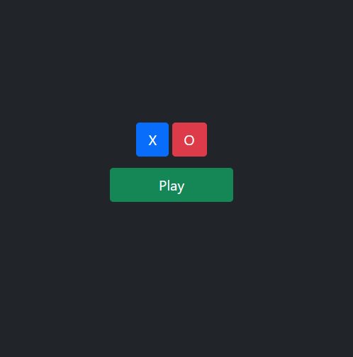
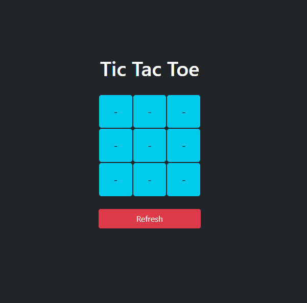
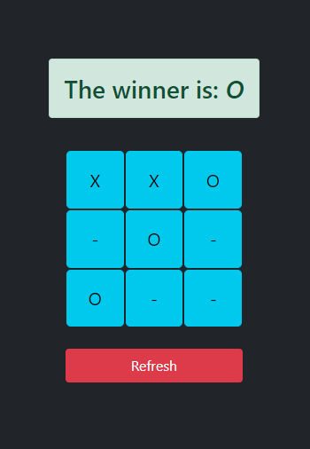
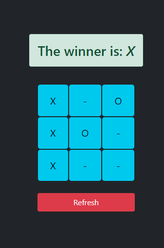
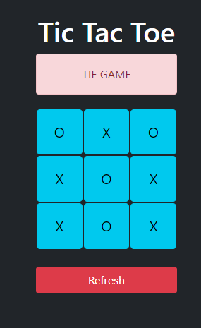

# Tic Tac Toe Game

This is a simple Tic Tac Toe game implemented using Python(Django), HTML, and CSS (Bootstrap).

## Game Rules

1. Two players take turns marking empty cells on a 3x3 grid.
2. Player 1 chooses the symbol "X" and Player 2 chooses the symbol "O".
3. The first player to get three of their symbols in a row (horizontally, vertically, or diagonally) wins the game.
4. If all cells are filled and no player has won, the game is a tie.

## Installation and Usage

1. Clone the repository

https://github.com/khmdvjamshid/PlayTicTacToeOnline.git

2. Navigate to the project directory:
```console
cd tic-tac-toe-game
```

3. Create and activate a virtual environment (optional):
```console
python3 -m venv env
source env/bin/activate
```

4. Install the required dependencies listed in requirements.txt
```console
pip install -r requirements.txt
```
5. Set up the database using:
```console
python manage.py migrate
```

## Running the Game

1. Start the Django development server: 
```console
python manage.py runserver
```
2. Open a web browser and visit `http://localhost:8000` to access the game.
3. The first player to access the game will be prompted to choose their symbol ("X" or "O").
4. Players take turns clicking on the cells to make their moves.
5. If a player wins or the game ends in a tie, a message will be displayed indicating the result.
6. To restart the game, click the "Refresh" button.

## Screenshots
_The Tic Tac Toe Main page_


_The Tic Tac Toe game board_


_A message indicating the game result_



_A message indicating the game result_



_A message indicating the game result_




## Technologies Used

* Python 3
* Django 4.2

## Contributing

Contributions are welcome! If you find any issues or have suggestions for improvements, please open an issue or submit a pull request.

## License

This project is licensed under the MIT License. See the [LICENSE](LICENCE) file for details.
